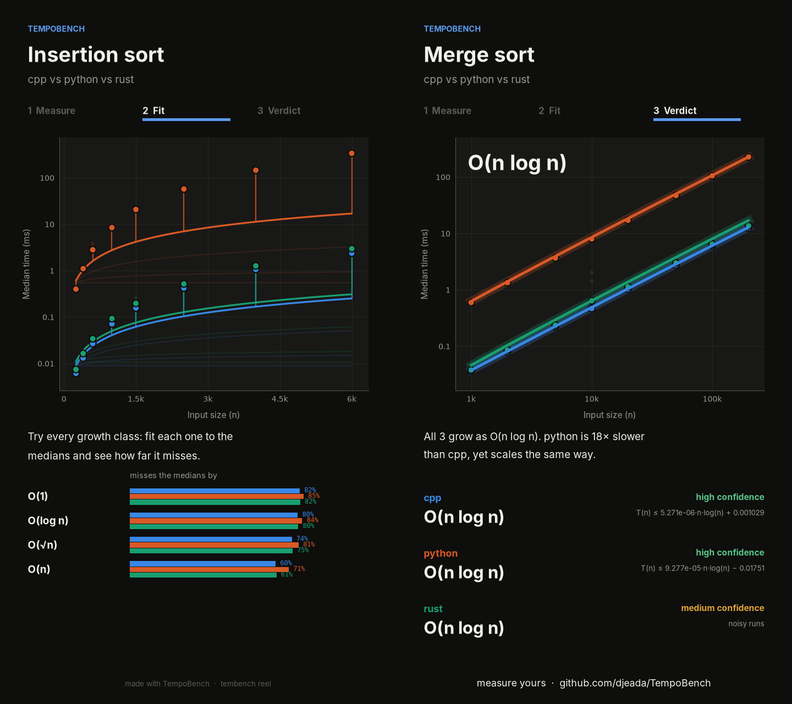

# TempoBench

A language-agnostic benchmarking CLI that runs any command with parameter sweeps, records timing and memory, estimates Big-O complexity with an honest confidence rating, and generates reports, all from a single YAML config.


## Features

- **Parameter sweeps** — define grids of inputs and implementations; every combination is executed with configurable repeats, warm-ups, and timeouts.
- **Parallel execution** — run grid points concurrently with `--workers`/`-j` to cut total benchmark time on multi-core machines.
- **Metrics collection** — wall-clock time and peak RSS are captured per trial using OS-native tools (`psutil`), with outlier filtering via Tukey fences.
- **Self-reported timing** — a benchmarked command can print its own inner timing so process startup is excluded from the measurement. See [Measuring the work, not the process](#measuring-the-work-not-the-process).
- **Complexity estimation** — observed runtimes are fitted against nine classes from O(1) to O(n² 2ⁿ) using a multi-layer algorithm (outlier-robust constant detection, log-log slope fallback, step-up OLS with adaptive thresholds, and tail-ratio guards). The best model is selected and overlaid on plots.
- **Fit confidence** — every fitted class is reported with a confidence rating and the caveats behind it, so a class the measurements cannot support is never presented as though they did.
- **CI-ready exit codes** — a run in which trials failed, or a summary with nothing in it, exits non-zero instead of reporting success.
- **Interactive charts** — Vega-Lite charts with click-to-toggle legend, crosshair tooltips, and smooth fit curves. Data points shown as discrete markers, fit lines as smooth interpolated curves. Every grid axis besides the input size gets its own series, and grid points where no trial succeeded (or values a log axis cannot show) are left out with a note on the chart rather than drawn as zero.
- **Rich CLI output** — live progress bars, colored status tables, and system-info display powered by [Rich](https://github.com/Textualize/rich).
- **Reports & dashboards** — a single-file HTML report that leads with each series' complexity class and confidence, then trial status counts, the runtime chart, complexity fits, the results table, the grid points that produced no measurement, and system information; a dashboard combining the runtime, memory, heatmap and per-size distribution charts; and a comparison report from `compare` that leads with each point's verdict and change against the baseline. Pages follow the system's light or dark theme. Chart data and styling are embedded; the Vega renderer loads from a CDN, so drawing charts needs network access.
- **Reels** — `tembench reel` turns a finished run into a ~23-second vertical video for sharing or teaching: the measurements arriving in run order, every complexity class tried against them, and the verdict. See [Reels](#reels).
- **Baseline comparison** — flag regressions against a previous run above a configurable threshold. Rows match on whatever grid columns the two summaries share, so any sweep works.
- **Reproducibility** — a provenance snapshot records the seed, invocation, and the CPU/memory of the machine that ran the benchmark. Reports read it back, so a report built on your laptop still describes the CI runner that produced the numbers.

## Installation

Requires Python 3.10+. Not published to PyPI yet, so install from a clone:

```bash
git clone https://github.com/djeada/TempoBench
cd TempoBench
pip install -e .
```

For `tembench reel`, add the `reel` extra (`pip install -e ".[reel]"`) and have
`ffmpeg` on the PATH.

For development (adds pytest, ruff, mypy, and matplotlib):

```bash
pip install -e ".[dev]"
pytest          # ~25s; compiles the cross-language example if g++ and rustc exist
ruff check src tests
mypy
```

## Quickstart

**1. Define a benchmark** in YAML (see [`examples/unique_bench.yaml`](examples/unique_bench.yaml)):

```yaml
benchmarks:
  - name: py_unique_count
    # {python} expands to the interpreter TempoBench runs under.
    cmd: "{python} examples/unique_impl.py --n {n} --impl {impl} --seed 42"

grid:
  n: [2000, 5000, 10000, 20000, 50000, 100000, 500000, 1000000]
  impl: ["quadratic", "sort_scan", "hash_set"]

limits:
  timeout_sec: 30
  warmups: 1         # discard the first, cold measurement per grid point
  repeats: 5         # enough samples for the median to mean something
  metric: reported   # the command times itself; see below
```

> The measurement protocol matters as much as the fitting. On this very
> benchmark, dropping to `warmups: 0, repeats: 2` leaves too few samples to
> filter outliers or trust a median, and every fit comes back rated **low**
> confidence. `tembench validate` warns about a protocol that thin before you
> spend time on it.

**2. Check it before committing to a full sweep:**

```bash
tembench validate --config examples/unique_bench.yaml
```

This prints the planned sweep, expands a sample command, and runs the cheapest
grid point once — so a typo, a missing interpreter, or a config that would
silently fall back to wall-clock timing surfaces in seconds rather than after a
long run. It exits non-zero if the command does not run.

**3. Run the pipeline:**

```bash
# Sequential (default)
tembench run --config examples/unique_bench.yaml --out-dir artifacts

# Parallel — 4 workers for faster execution
tembench run --config examples/unique_bench.yaml --out-dir artifacts -j 4

tembench summarize --runs artifacts/runs.jsonl --out-csv artifacts/summary.csv
tembench plot --summary artifacts/summary.csv --out-html artifacts/runtime.html
```

**4. Generate a full report:**

```bash
tembench report --summary artifacts/summary.csv
```

## Examples

| Example | What it shows |
|---------|---------------|
| [`examples/unique_bench.yaml`](examples/unique_bench.yaml) | Three ways to count unique values (O(n²), O(n log n), O(n)) in one sweep; `run_example.sh` runs the whole pipeline on it |
| [`examples/sort_bench.yaml`](examples/sort_bench.yaml) | Python's sort on random, sorted and reversed input |
| [`examples/cross_language`](examples/cross_language) | Seven algorithms, one per class, in C++, Rust and Python: checks that every language computes the same result and is fitted the same class |
| [`examples/top_100_algorithms`](examples/top_100_algorithms) | 100 Python algorithms fitted from deterministic step counts, with wall clock as supporting evidence |

## CLI Commands

| Command       | Description                                                |
|---------------|------------------------------------------------------------|
| `validate`    | Check a config and trial-run its cheapest grid point       |
| `run`         | Execute benchmarks and write JSONL results                 |
| `summarize`   | Aggregate runs into CSV with medians, percentiles, counts  |
| `plot`        | Generate a runtime chart with optional Big-O fit overlay   |
| `report`      | Build a single-file HTML report                            |
| `compare`     | Detect regressions against a baseline summary              |
| `dashboard`   | Create a multi-chart interactive dashboard                 |
| `inspect`     | Preview recent runs in a table                             |
| `memory`      | Generate a memory-usage chart                              |
| `heatmap`     | Generate a performance heatmap                             |
| `reel`        | Render a short vertical video of the run and its fit       |
| `sysinfo`     | Display system information for reproducibility             |

Run `tembench --help` or `tembench <command> --help` for full option details. Every chart and report command takes its output path as `--output` or `--out-html`, and `plot`, `dashboard`, `memory` and `heatmap` take `--bench` to chart one benchmark.

Axes switch to a log scale on their own when the values span more than 30×, which
timings across a sweep almost always do; `--log-x/--no-log-x` and
`--log-y/--no-log-y` force either (the heatmap's colour scale: `--log-color/--no-log-color`).
Every page follows the system's light or dark theme, with a toggle in the header,
and a series keeps its colour across every chart.

### Arbitrary grids

`n` and `impl` are the bundled examples' names, not requirements. Every command
reads the sweep axes off the summary: the input size is the numeric grid column
swept most widely, and the series is whatever axis is left. So this works with no
extra flags:

```yaml
grid:
  vertices: [100, 1000, 10000, 100000]
  algorithm: ["dijkstra", "bellman_ford"]
limits:
  growth_key: vertices     # which axis `prune_on_timeout` treats as the size
```

```
$ tembench plot --summary artifacts/summary.csv
Axes  x = vertices, series = algorithm (inferred; override with --x / --color)
```

Pass `--x` and `--color` to override the inference; `compare` likewise joins on
whatever grid columns the two summaries share.

## Reels

```bash
pip install -e ".[reel]"     # matplotlib draws the frames; ffmpeg encodes them
tembench reel --summary artifacts/summary.csv --title "Merge sort" --poster artifacts/reel.png
```



A reel is a 1080×1920 MP4 in three acts:

1. **Measure.** `runs.jsonl` is replayed in the order the trials actually ran.
   Each run lands as a dot, and a size's median appears once all its runs are in.
2. **Fit.** Every complexity class is fitted to the medians in turn, simplest
   first. Lines tie each median to the curve, so how badly O(1) or O(n) misses
   can be seen, and a leaderboard ranks the classes by how far they miss.
3. **Verdict.** The fitted bound, the class, and its confidence, with the
   caveat behind any rating below high. When the series share a class, the
   headline says so: "All 3 grow as O(n log n). python is 18× slower than cpp,
   yet scales the same way."

The fits are the same ones as in `fits.csv` and the report. `--speed 1.5`
makes a ~15-second cut, `--width` sets the resolution, `--poster` also saves the
final frame (or, with `--no-video`, only that), and `--bench`, `--x` and
`--color` choose what to show, as for the charts.
`python examples/cross_language/run_all.py merge_sort --reels` benchmarks an
algorithm in three languages and renders its reel.

## Measuring the work, not the process

Timing a whole process also times everything around the work: interpreter or
runtime startup, dynamic linking, argument parsing, input generation. That
overhead is a **constant added to every reading**, and a constant is exactly
what destroys a complexity estimate — it flattens the curve most at small `n`,
where the signal is weakest.

Concretely: sweeping `examples/unique_impl.py` over `n = 50k … 800k`, the
self-reported timings of `sort_scan` and `hash_set` grow with measured exponents
of about 1.15. The wall-clock column of *the same trials* grows with exponents
of only 0.7–0.8, because ~25 ms of Python startup sits on top of every reading
and takes up a large share of the small ones. That is enough to move `hash_set`
from O(n log n) to O(n), and the smaller the inputs, the flatter wall clock
makes the curve.

To measure the work, have the command time its own hot section and print one
line on stdout:

```
TEMPOBENCH_MS: 12.345
```

The marker is deliberately trivial so any language can emit it — `:`, `=`, or a
space all work as the separator, and if it is printed more than once the last
occurrence wins. It may appear anywhere in the output, however much is printed
after it. `examples/unique_impl.py` shows the pattern, and
[`examples/cross_language`](examples/cross_language) does the same in C++, Rust
and Python.

Then choose how durations are taken, via `limits.metric`:

| Value      | Behaviour                                                                    |
|------------|------------------------------------------------------------------------------|
| `auto`     | Default. Use the marker when the command prints one, else fall back to wall clock. |
| `reported` | Require the marker; a trial without one is recorded as failed.                |
| `wall`     | Always use wall-clock time of the whole process.                              |

Both readings are always kept in `runs.jsonl` (`wall_ms` and `reported_ms`), so
the startup cost stays inspectable. `summarize` picks the canonical duration per
series into `time_ms_*` and records which one it used in `time_source`. It never
mixes the two inside a series — a series where only some trials reported would
otherwise show a step no algorithm produces.

If the command cannot be modified, use wall clock but push `n` high enough that
the constant is negligible. TempoBench flags the fit as `overhead-dominated`
when it is not.

## Fit Confidence

Fitting always returns a class. Whether that class means anything depends on the
measurements behind it, so every fit is reported with a confidence rating and
the reasons for it, in `fits.csv` (`confidence`, `confidence_notes`), in the
terminal, in chart tooltips, and in the HTML report.

`fits.csv` names the best rival class in `runner_up` and records how far
behind it scored in `model_margin` — an ordinary ΔAIC, computed from the
relative residuals of each class's fit. When the rival is within 6 the terminal
prints the pair as `O(n log n) ≈ O(n²)`. Clean data decides by tens to a
couple of hundred (relative errors below 0.01% count as timer resolution, which
caps it); on a short, noisy sweep the margin collapses, and saying so is more
useful than picking one of the two and sounding certain. The margin is slightly negative
only when the tail check (see [Complexity Fitting](#complexity-fitting)) chose a
simpler class the score could not separate from the winner.

A fit is downgraded once per caveat that applies — one caveat gives `medium`,
two or more give `low`:

| Caveat               | Meaning                                                    |
|----------------------|------------------------------------------------------------|
| `few-points`         | Fewer than 4 distinct input sizes — classes cannot be separated. |
| `narrow-n-range`     | Input sizes span less than 8× (for an exponential class, less than 3 doublings). |
| `flat-signal`        | Durations span less than 2× — nothing grew enough to fit.  |
| `wide-exponent-ci`   | The bootstrap exponent interval is wider than 0.5.         |
| `overhead-dominated` | Over 50% of the largest reading is constant overhead.      |
| `ambiguous-class`    | Another class fits almost as well: ΔAIC under 6, or under 10 with fewer than 6 input sizes, where the noise itself is poorly estimated. The textbook 2 is too lenient for a nine-way contest on a handful of points. |
| `poor-fit`           | Even the best class misses the readings by over 20% on average — growth faster than any class, or a curve with a kink. |
| `exponent-mismatch`  | The bootstrap exponent interval lies outside the range the class produces — typically cache effects bending the curve between two classes. |
| `single-point-growth`| The series is flat except for the largest input size — one reading decides the class. |
| `constant-class`     | The fit is `O(1)`. A flat curve is also what a sweep that never reached large enough inputs looks like, so `O(1)` is never rated `high`. |
| `outlier-dropped`    | `O(1)` only after discarding one outlying reading (never the largest input). |
| `non-positive-timings` | Some durations are zero or negative — below timer resolution; they are left out of the exponent estimate. |
| `thin-samples`       | Fewer than 3 trials per input size.                        |
| `unstable-timings`   | Repeated trials of one point disagree by over 50% of its median — usually a busy machine. |

Confidence is advisory: it never changes the fitted bound, only how much you
should trust the label on it. Rows with a missing or non-finite size or duration
are ignored, and a series left with fewer than two points is not fitted.
`fits.csv` carries the caveats twice: as prose in `confidence_notes`, and as
the codes above in `caveats`, for scripts and CI checks.

### Measure on a quiet machine

Timings are only as good as the machine that took them. A benchmark sharing a
CPU with a build, a video encode, or another benchmark will produce medians that
still trace a smooth curve — a smooth *wrong* curve. TempoBench flags this when
repeated trials of the same point disagree (`unstable-timings`), but the fix is
to run the sweep on an idle machine and, in CI, on a dedicated runner.

### What a measured class does and does not mean

A fit describes **elapsed time on the machine that ran it**, not the operation
count of the algorithm. Those diverge once an input stops fitting in cache: in
the example benchmark, `hash_set` performs a textbook O(n) number of operations
but measures around n^1.24 from 10⁴ to 5·10⁶ elements, because the memory
hierarchy, not the hash table, sets the pace at the top of that range. This is a
real property of the code on that hardware and TempoBench reports it faithfully;
it is not a substitute for analysing the algorithm.

[`examples/cross_language`](examples/cross_language) shows this from the other
side: binary search over 4 million elements measures as O(√n) in C++, Rust and
Python alike, and as O(log n) in all three once the array fits in cache. Its
README lists the other ways a benchmark ends up measuring the machine instead
of the algorithm: a branch predictor that has memorised the input, or a
hardware fast path for small operands.

If you want the operation count instead, have the command count operations and
emit that number through the marker. Nothing downstream inspects the units, so
the fit is over whatever you report — only the axis labels will still read "ms".
[`examples/top_100_algorithms`](examples/top_100_algorithms) takes this approach,
using deterministic Python step counts as the authoritative signal and treating
wall-clock timings as supporting evidence.

## Exit Codes

TempoBench is meant to run in CI, so commands fail loudly rather than producing
empty artifacts:

| Situation                                   | Exit | Override           |
|---------------------------------------------|------|--------------------|
| `validate` probe could not run the command  | 1    | `--no-probe`       |
| No trial succeeded                          | 1    | —                  |
| Some trials failed or errored               | 1    | `--allow-failures` |
| Trials timed out or were skipped            | 0    | `--strict` makes it 1 |
| `summarize` found no successful trials      | 1    | —                  |
| A chart or report was asked for empty data  | 1    | —                  |
| `compare` detected a regression             | 1    | —                  |
| `compare`: a point the baseline measured has no timing now (all trials failed, or it is missing) | 1 | — |

A failing run prints each distinct failure with the command's own last message,
rather than only a count.

`summarize` keeps a row for every grid point that was attempted, including one
where every trial failed or timed out; its timing columns are empty and its
status counts say why. `compare` treats such a row as a regression when the
baseline measured it. When one summary's timing is self-reported and the
other's is wall clock for the same point, `compare` judges that point on wall
clock, since the difference between the two is process startup.

## Parallel Execution

By default, benchmarks run sequentially (`workers: 1`) for the most accurate
timing. When wall-clock precision is less critical and throughput matters,
use multiple workers to run grid points concurrently:

```bash
# CLI flag (overrides config)
tembench run --config bench.yaml -j 4

# Or set in YAML
limits:
  workers: 4
```

> **Note:** Parallel runs share CPU and memory bandwidth, so individual timings
> may show more variance than sequential runs. Use `-j 1` (default) for
> publication-quality measurements; use `-j N` for rapid iteration and CI.

In sequential mode, `prune_on_timeout` and `pin_cpu` work as expected.
In parallel mode, CPU pinning is disabled, and pruning only skips the remaining
repeats of the grid point that timed out: larger inputs are not pruned, since
grid points are dispatched independently.

## Artifacts

All output is written to the `--out-dir` directory (default `artifacts/`):

| File              | Format | Contents                                      |
|-------------------|--------|-----------------------------------------------|
| `runs.jsonl`      | JSONL  | One JSON object per trial (status, wall_ms, reported_ms, peak_rss_mb, metric, stdout/stderr tails; attempts when retried) |
| `provenance.json` | JSON   | Seed, worker count, CLI invocation, working directory, and the benchmark machine's platform/CPU/memory |
| `summary.csv`     | CSV    | Median/mean/p10/p90 per grid point, for both the canonical (`time_ms_*`) and wall-clock (`wall_ms_*`) durations |
| `runtime.html`    | HTML   | Vega-Lite runtime chart with complexity overlay |
| `fits.csv`        | CSV    | Best-fit model, runner-up and margin, exponent CI, coefficients, residuals, and confidence with its caveats per series |
| `report.html`     | HTML   | Self-contained report: per-series complexity cards, run overview, runtime chart drawn from the summary, fits, results, and system info |

## Complexity Fitting

Candidate models: **O(1)**, **O(log n)**, **O(√n)**, **O(n)**, **O(n log n)**, **O(n²)**, **O(n³)**, **O(2ⁿ)**, **O(n² 2ⁿ)**. The two
exponential classes are only considered when the largest input is at most 64:
nothing exponential finishes far beyond that.

Every class is fitted as `T(n) = C·f(n) + baseline`. The baseline is the
constant overhead. It may dip below zero by at most a quarter of the smallest
reading, enough to absorb a cost per element that rises a little with n (small
inputs staying in cache), but not enough for a slower class to pass for a
faster one: `C·n − b` imitates `n log n` over a finite range.

1. **Constant detection** — the series is `O(1)` when max/min stays within 1.15×,
   or within 1.5× with no monotone trend; one outlying reading may be discarded
   for this test, but never the one at the largest input size.
2. **Log-log slope fallback** — two points, or three spanning less than 5× in
   duration, cannot support a model comparison; the empirical exponent picks
   the class.
3. **Relative-error fits** — otherwise every class is fitted by least squares on
   *relative* error (weights 1/y²), so a sweep spanning several decades is fitted
   at its small sizes as well as its large ones, and ranked by the AIC of those
   same residuals. Lowest AIC wins.
4. **Tail check** — among classes within ΔAIC 2 of the winner, which the data
   cannot tell apart, step down to the simpler one when the growth between the
   two largest sizes, net of the fitted baseline, is closer to it. A class the
   data clearly rejects is never chosen.
5. **Confidence assessment** — rate how well the measurements support the chosen class; see [Fit Confidence](#fit-confidence).
   The empirical exponent and its bootstrap interval are measured net of the
   fitted baseline, so they describe the work: O(n²) plus startup measures
   n^2.0, not the n^0.5 its raw log-log slope shows.

The selected fit is scaled up by the smallest factor that makes it a proper **upper bound** — the fit line sits at or above every observed data point, as Big-O semantics require, while staying as tight at small n as at large. The plot shows the Big-O class (e.g. `O(n log n)`) on the curve, and the chart subtitle lists the concrete bound formula of each series (e.g. `T(n) ≤ 5.36e-05·n·log(n) + 55.7`), which is also in the curve's tooltip. Use `--complexity-strategy strict` to surface an empirical exponent band like `O(n^1.08±0.07)` when the confidence interval overlaps a neighboring class boundary.

```bash
tembench plot --summary artifacts/summary.csv --export-fits artifacts/fits.csv
tembench plot --summary artifacts/summary.csv --complexity-strategy strict
tembench plot --summary artifacts/summary.csv --no-fit      # disable overlay
tembench plot --summary artifacts/summary.csv --out-html -  # Vega-Lite JSON to stdout
```

`plot` prints the fitted class, its upper bound, and its confidence for every
series, so the headline result is visible without opening the HTML.

## Configuration Reference

```yaml
benchmarks:
  - name: my_benchmark          # identifier for this benchmark
    cmd: "my_program --size {n}" # command template; {keys} are expanded from grid
                                 # {python} is built in: this interpreter's path
    build: "make release"        # optional build step, run through the shell once
                                 # before trials; if it fails, that benchmark's
                                 # trials are recorded as errors and the run exits 1
    workdir: "."                 # optional working directory
    env: { MY_VAR: "1" }        # optional environment variables

grid:
  n: [100, 1000, 10000]         # parameter grid; all combinations are swept.
                                # Values are numbers or strings; names used by
                                # trial records (status, cmd, metric, …) are
                                # reserved

limits:
  timeout_sec: 30               # per-trial timeout (SIGTERM to the process
                                # group, then SIGKILL)
  warmups: 1                    # discarded warm-up runs per grid point
  repeats: 3                    # measured repetitions per grid point
  rss_poll_interval_sec: 0.01   # RSS sampling cadence; does not affect timing
  workers: 1                    # parallel workers (1 = sequential, default)
  prune_on_timeout: false       # after a timeout, skip that point's remaining
                                # repeats and larger growth_key values for that
                                # series only (other grid axes unaffected)
  shuffle: true                 # randomize sweep order to reduce drift
  growth_key: "n"               # grid key treated as the input size
  metric: auto                  # auto | wall | reported — see "Measuring the work"

pin_cpu: 0                      # optional: run the benchmark on this core alone
                                # (Linux, sequential only); TempoBench keeps
                                # its own threads off it
```

### Commands

`cmd` is split into arguments and run directly, **without a shell**, so pipes,
redirects, `&&` and `$VARS` are passed to the program as literal text. Each
grid value is substituted as exactly one argument, quoted as needed, so
`"two words"` or `"it's"` arrive intact. Format specs still apply (`{n:06d}`),
and `{key:raw}` inserts a value verbatim, for a grid axis that holds whole
command lines.

When a benchmark does need a shell, run one explicitly and pass grid values as
positional arguments, which is safe for any value:

```yaml
cmd: "sh -c 'seq \"$1\" | sort -n > /dev/null' sh {n}"
```

`--retries N` re-runs a failed repetition up to N more times. Only the final
attempt is recorded (with an `attempts` count), so a flaky trial that
eventually passes counts as successful; the run summary notes how many needed
a retry. Processes a benchmark leaves running in the background are killed
when it exits (POSIX).

Peak memory is the child's own high-water mark as the OS tracks it (so a
brief spike between samples is not missed) plus, for commands that spawn
several processes, a sample of the whole tree every 0.1 s that counts pages
shared between processes once. A trial with no reading at all has no
`peak_rss_mb` rather than `0`.

## License

[MIT](LICENSE)
